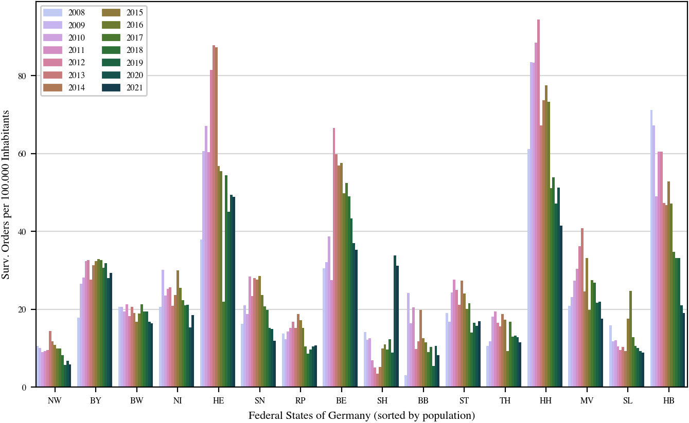
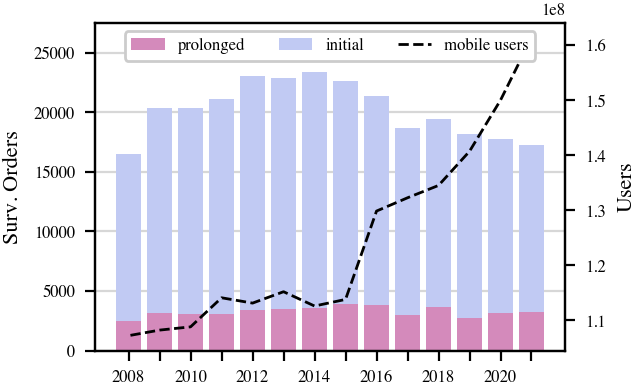

# DataLiteracy Project Report: 
# A study of german telecomunication surveillance
This repository stores all data and code for a study of german telecomunication surveillance that was conducted as a project in the DataLiteracy Course at the University of Tübingen, Winter Term 2023/24.

# Introduction: 
We want visually explore telecommunication surveillance data to contribute to legal transparancy. You can explore the data in an interactive via `streamlit` interface:
```console
streamlit run ./src/st_page.py
```


##  Data
1. Main data is taken from Bundesjustizamt [Statistiken der Rechtspflege](https://www.bundesjustizamt.de/DE/Service/Justizstatistiken/Justizstatistiken_node.html#AnkerDokument44152) web page. `surveillance_data.xlsx` conatains full data for years 2013, 2016, 2019-2022, and the number of inital on prolonged orders (§4) for 2008-2021 on separate sheets.
2.  Population data was aquired in *GENESIS-Online* [database](https://www-genesis.destatis.de/genesis//online?operation=table&code=12411-0010&bypass=true&levelindex=0&levelid=1705062410665#abreadcrumb) of the Federal Statistical Office
3. Data for development of number of mobile device users in Germany: https://www.bundesnetzagentur.de/DE/Fachthemen/Telekommunikation/Marktdaten/Mobilfunkteilnehmer/artikel.html
4. Data regarding federal governments was collected by hand and is stored in dat/election_results_per_states folder






# Assumptions
1. Judges are appointed by the state governments (simplification, does not live up to legal processes in detail)
2. Each order for surveillance only targets a solitary individua
# Hypotheses tested
1. Did the trend of dependancy between number of mobile device users and surveillance orders continued (compared to the data between 1990 and 2000)?
2. Is there a difference in survillance rates between the states where the certain party is introduced in the ruling government (in 2021)? 
3. Do the survilled crimes distributed differently across states (in 2021)?

# Results
1. **to fill**
2. All the parties have an effect on the rates between the samples basen on their presense in the government. Linke, Grüne and FW indicate (chould not be confused with the direct influence) higher survillance rates in the states where they rule. SPD, CDU, FDP on the other hand indicate a decrease in probability of being survilles.
3. Althouth the most survilled crimes remain the same (Narcotics, Fraud, Gang theft, Murder, Robbery). Their distribution is unique across each of the 5 states chosen to the test.
